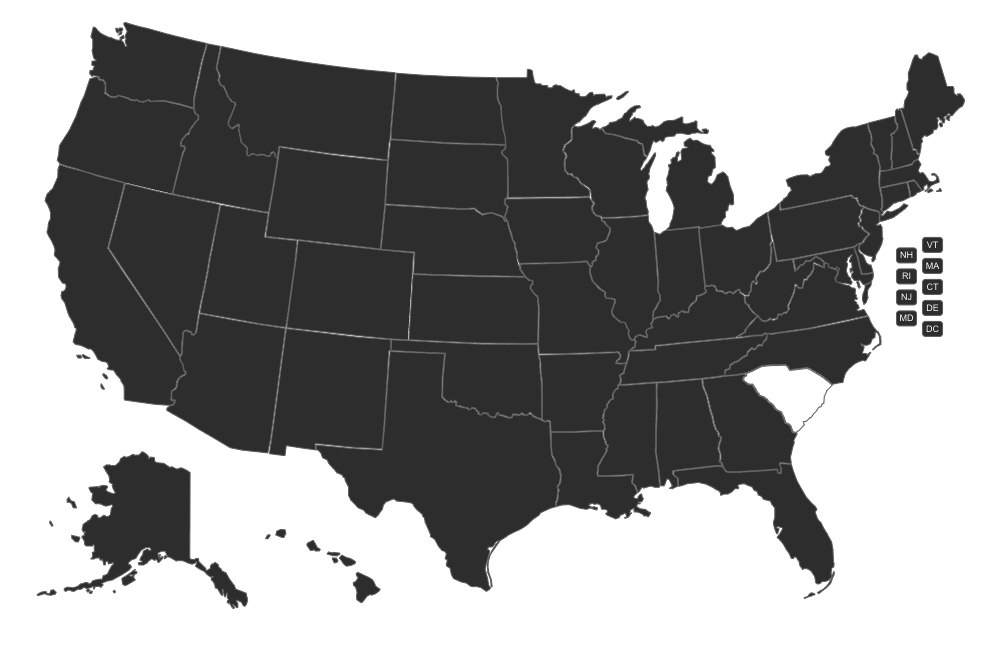
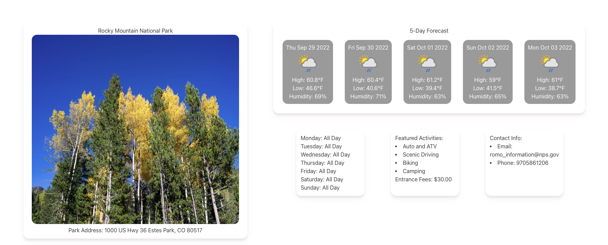

# National Park Finder
 https://rarellano5280.github.io/National-Park-Finder/

## Description
We created a webpage that allows a user to click on an interactive map in order to display the state's most popular national park. Our webpage also displays a five-day forecast so that they can prepare for the adventure they will soon embark on. In addition, our webpage will display a few other details about the park such as hours of operation, activites to do, cost and a picture of the park. 

## Project Requirements

- ✅ Use a CSS framework other than Bootstrap.
- ✅ Be deployed to GitHub Pages.
- ✅ Be interactive (i.e., accept and respond to user input).
- ✅ Use at least two server-side APIs.
- ✅ Does not use alerts, confirms, or prompts (use modals).
- ✅ Use client-side storage to store persistent data.
- ✅ Be responsive.
- ✅ Have a polished UI.
- ✅ Have a clean repository that meets quality coding standards (file structure, naming conventions, follows best practices for class/id naming conventions, indentation, quality comments, etc.).
- ✅ Have a quality README (with unique name, description, technologies used, screenshot, and link to deployed application).

## User Story
* As a outdoor enthusiast,
* I WANT a webpage that helps me find a popular national park in each state
* SO THAT I can plan a trip 
* I WANT to be able to select a state,
* SO THAT I can see the most current weather and forecast of the upcoming weather,
* I want to be able to see important details about the park, 
* SO THAT I can be prepared when I arrive. 

# Acceptance Criteria
* WHEN I open the webpage I am presented with a polished UI,
* THEN I can choose a state that I am interested in
* WHEN I interact with the webpage,
* THEN my interaction is saved to local storage
* WHEN my interaction is proccesed,
* THEN our webpage will fetch data from two seperate API's and deatails of the users selecion will be rendered to the page ie. (Park info, weather, image of park)
*When I click on a different state,
* Then my current previous selection is replaced with my current selection.

# Usage 
* When the user views the top of the page they will see our header with links to additional resources and a contributors page.

* The user can then navigate down and they will be presented with a map of the United States. 

* If the user hovers over the map they will find that this map is interactive and clickable.
* When the user clicks on the map they will be presented with a famous national park from that selected state, they will also be presented with park information and a 5 day forecast for the area.

* The name of the park they selected will be saved to local storage. 
* The user can click on a different state to overide their current selection. 

# Authors
* Robert Arellano
* Madisen Vogel
* Antonio Duran
* Eugene isingizwe

## License
MIT License

Copyright (c) 2022 Robert
